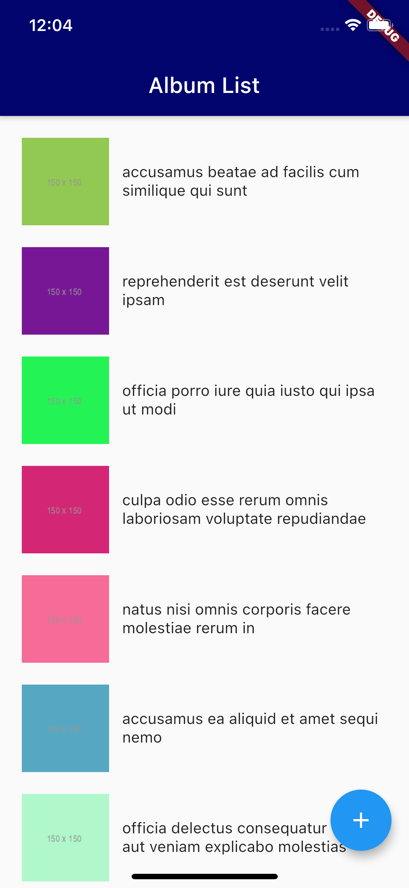
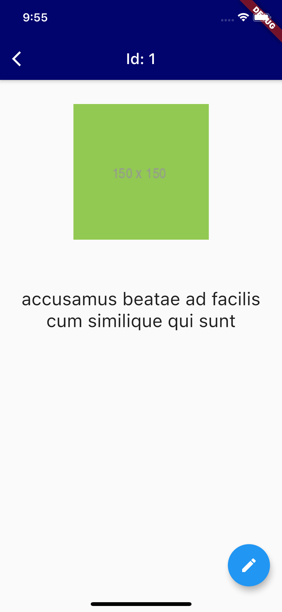
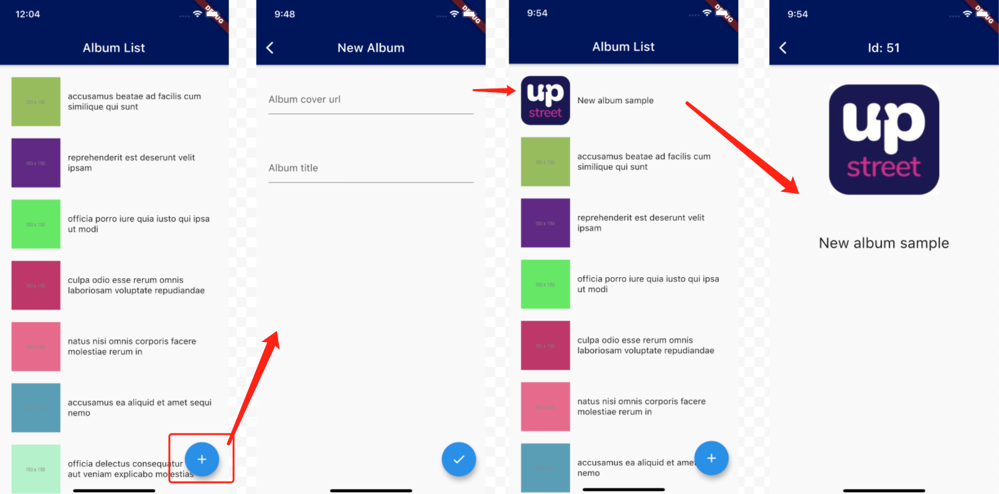
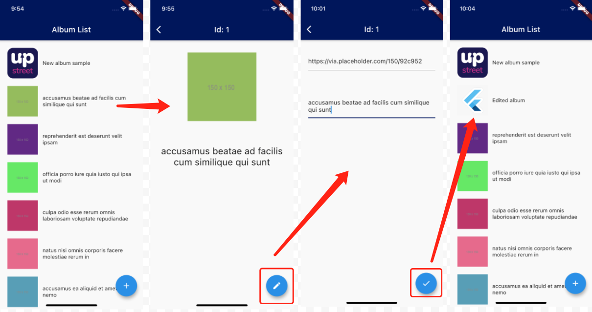

# Upstreet Flutter code challenge - The album photo list

> **Please note that, don't upload this README file to any public repository**. 

## Requirement

### 1. Pull the dummy data from the provided url to render a list. The list items contain a thumbnail and a title.

  

### 2. Click on any of the items to view the details

  

### 3. Create a new album

- Open the NewAlbum page after clicking the "Add" floating button on the AlbumList page. 
- Back to the AlbumList page after saving the new album data.
- The new added album should be the first item of the list.
- The `id` of the new album should be an increment of the last existing item's `id`.

  

### 4. Edit an album

- Click the "Edit" floating button on the AlbumDetails page to start editing the album.
- The cover url and the title are editable.
- Back to the AlbumList page after saving the changes by clicking the "Save" floating button.
- The AlbumList page should refresh and display the latest data.

  

## Data source

Please use https://jsonplaceholder.typicode.com/albums/1/photos as the data source, you can also preview the response structure by clicking to launch the url.

## Add-on

- You're not required to build a pixel-perfect UI as the above sample image.
- Feel free to create the necessary files with a good project structure.

## Submission

Please submit your solution as either a single zip file or a link to the zip file.

